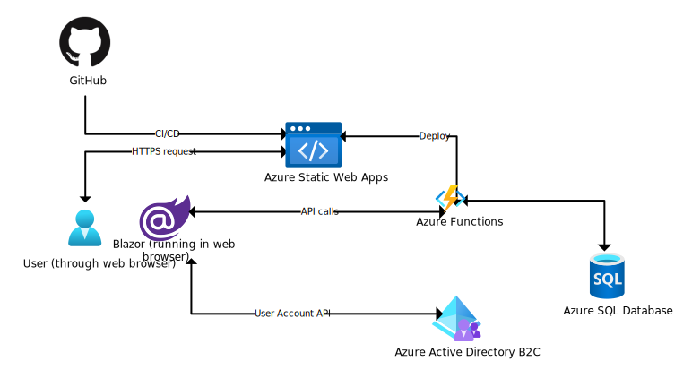

# Cloud Class Project
50:198:541 Parallel, Distributed, Grid, and Cloud Computing with Ian Lebbern, Rutgers University-Camden, Spring 2021  
Doug Jih

[Deployment Site](https://proud-pond-036294e0f.azurestaticapps.net)

## Objective
Design and implement a cloud application to demonstrate using cloud services.

## Application Description

The is a cloud web app that helps the user identify and track sports betting pairings for promotional arbitrage.
1. The user can enter candidate sports betting parings, each of which consists of opposite outcomes of the same event at two different casinos.
1. The app calculates the projected profits and losses for each outcome.
1. The app keeps persistent memory of the entries in cloud storage.
1. The app provides account creation and sign-in to allow multiple users to have separate and private books.
1. The app runs in a modern web browser and requires no explicit installation of software.

## Design

This project uses [Blazor](https://dotnet.microsoft.com/apps/aspnet/web-apps/blazor), a web framework that enables programming of single-page web apps using .NET and C#. It uses the Web Assembly type of Blazor, meaning that the app runs entirely in the web browser with no corresponding server side of the app.

This project uses [GitHub](https://github.com/) for code repository hosting and CD/CI. Upon a push of a new commit, the CI/CD action deploys the new code.

This project uses the following Azure cloud services:
- [Azure Static Web Apps](https://azure.microsoft.com/en-us/services/app-service/static/) - This PaaS web app service hosts a static front end web page connected to a dynamic back end of APIs, with streamlined CI/CD integration with GitHub. The service is designed to scale automatically to demand.
- [Azure Functions](https://azure.microsoft.com/en-us/services/functions/) - This PaaS service enables the back end APIs that allow code execution invoked by web requests. This project uses Azure Functions for the web app to perform access to the SQL database.
- [Azure SQL Database](https://azure.microsoft.com/en-us/products/azure-sql/database/) - This PaaS service can provide a relational database in a managed, serverless configuration. This project uses the database to persist its data.
- [Azure Active Directory B2C](https://azure.microsoft.com/en-us/services/active-directory/external-identities/b2c/) - This PaaS service provides identity management services. This project uses the service to provide user sign up and sign in.

This project uses the following software development tool:
- [Visual Studio](https://visualstudio.microsoft.com/) - a Microsoft integrated development environment (IDE)

## Discussions

Blazor seems like a useful technology that brings .NET programming to web apps. But it has been changing quickly and I find its documentation not that easy to understand.

Azure Static Web Apps makes deployment of scalable web apps easy, and its integration with GitHub makes setting up the basic CI/CD easy.

### SQL Database

I configured the SQL Database for the project to be "General Purpose: Serverless, Gen5, 1 vCore" in an effort to minimize the costs. Being serverless, the database is supposed to incur a charge only when it is being used. But I made a mistake of leaving the Microsoft SQL Server Management Studio software open, not thinking that it would keep talking to the database. This led to a $20 charge from the $100 of credit I got for a 1-year student account. Azure sent me an automated email about the $20 charge, however, and that alerted me to my mistake.

A problem with the configuration of the database is that it has a significant cold-start delay. I have noticed that it can take around half a minute to become ready, if it has not been used in more than an hour (configurable) and is paused. This is the price for minimizing uptime and the cost associated with it.

For the tiny usage of the SQL Database, I feel it has been quite expensive, even though I think I configured everything at the least expensive tier.

### Active Directory B2C

This allows the "out-sourcing" of identity management to a service, and looks very useful. However, I was unable to work out its integration with the web app in the time I had.

### Challenges
The number of choices in cloud services is ***vast***. Although I have been a software developer at work for about ten years for software specific to the business, I was completely new to cloud software development, and I had a paralysis by indecision and procrastination because of the uncertainty and doubts I felt. Pressure of the deadline eventually resolved the problem, but the delay was costly.

At first, I looked at using AWS with the "classroom" account, but I ended up using an Azure free trial account because certain aspects of an AWS classroom account (such as IAM) worked differently from a regular account, and I did not want to spend time figuring it out when tutorials did not work. Also, because I chose to use Blazor for my web app development because I had experience with using .NET and C# for desktop software development; and because Blazor is a Microsoft product, and Azure offers a more integrated deployment experience.

Nevertheless, I encountered a lot of difficulties getting anything to work beyond the pre-made examples in tutorials. Getting different components to work together often did not work, and troubleshooting was time-consuming. 

I felt that I did not have time to get a solid foundation of understanding on the technologies I was trying to use, but rather I was just trying to get something to work by imitation and trials and errors. That made for a frustrating experience. Although this was unpleasant, this was also useful in reminding me how the newer members at work might feel, and that I should be more proactive in offering to guide them.

### Background & Motivation
Sports betting is legal in New Jersey. It is possible to make small profits with sports betting without relying on luck by making use of promotional offers and betting on both outcomes of a two-outcome event at different casinos.

Betting on both outcomes alone ensures a small loss because of house edge, but if the promotional offer's value is greater than the house edge, then doing so results in a (modest) profit. Spreading bets on both outcomes at different casinos is both necessary and desirable: It is necessary because one cannot bet both outcomes at the same casino while using its promotion without running afoul of the promotion rules, but doing so at two different casinos is fine. It is also desirable because different casinos usually offer different odds for the same bet, and shopping them helps to reduce the loss to house edge.

Manually finding candidate parings can be time consuming: Doing so involves manually searching through and comparing the many potential candidates. A software program should be able to automate some of the search process and save time in the long term.

However, automating searching requires web scraping of dynamic and irregular web site contents from the online casinos. I deem this too much a difficulty and opt to omit this aspect, and focus on basic functionality that I feel I can feasibly develop in time: taking manual entries, calculating projected profits and losses, and keeping the entries in cloud storage.

### References

### Azure Static Web Apps

- [Tutorial: Building a static web app with Blazor in Azure Static Web Apps](https://docs.microsoft.com/en-us/azure/static-web-apps/deploy-blazor)
- [Build a Student Feedback Analyzer with Blazor, Azure Functions, Azure Static Web Apps and Azure Cognitive Services](https://dev.to/ashirwadsatapathi/build-a-student-feedback-analyzer-with-blazor-azure-functions-azure-static-web-apps-and-azure-cognitive-services-4acj)

####  Azure Active Directory

- [Secure an ASP.NET Core Blazor WebAssembly standalone app with Azure Active Directory B2C](https://docs.microsoft.com/en-us/aspnet/core/blazor/security/webassembly/standalone-with-azure-active-directory-b2c?view=aspnetcore-5.0)
- [Set up sign-up and sign-in with a Microsoft account using Azure Active Directory B2C](https://docs.microsoft.com/en-us/azure/active-directory-b2c/identity-provider-microsoft-account?pivots=b2c-user-flow)
- [Azure AD B2C Quickstart with Visual Studio & Blazor](https://medium.com/marcus-tee-anytime/azure-ad-b2c-quickstart-with-visual-studio-blazor-563efdff6fdd)
